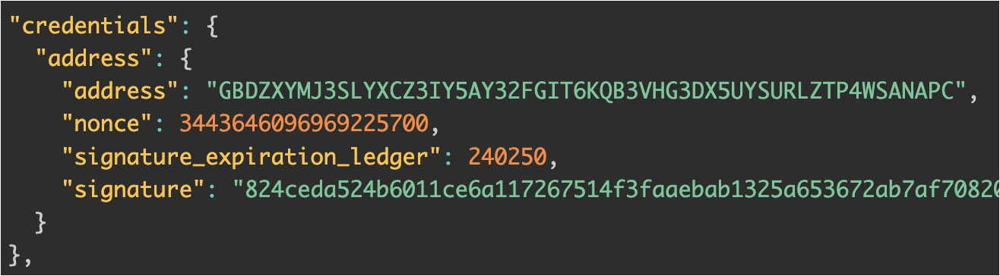

+++
date = '2025-05-12T08:58:19+02:00'
title = 'Who Can Sign What: How Blockchains Handle Authorization'
description = "A practical comparison of the authorization models of Ethereum, Stellar and Solana through the lens of real transaction data"
summary = "A practical comparison of the authorization models of Ethereum, Stellar and Solana through the lens of real transaction data"
series = ['Pairings for the rest of us']
tags = ['Blockchain', 'Ethereum', 'Stellar', 'Solana']
images = ['images/cover.jpg']
ShowShareButtons = true
ShowToc = true
+++
The EIP-7702 as part of Pectra upgrade is already live, and one of its promises is to fix a long-standing UX issue: swapping a token on a DEX requires two transactions - one to approve the token transfer and another to execute the swap. For regular Ethereum users, this two-step process is an annoyance, for newcomers, it's confusing. But here’s the thing - this problem isn’t universal.

The idea for this article started from a simple research about why, in other ecosystems, token approvals are a non-issue, and evolved into a comparison of the authorization mechanisms of three blockchains: **Ethereum, Stellar Soroban and Solana**.

To understand these differences more clearly, we’ll look closely and **compare the transaction structures** across the three blockchains. Along the way, we will define a few scenarios in transaction handling - analyzing who can sign what and when.

Very often, when working within a particular ecosystem, we build up biases about what's possible and begin to take certain issues or bottlenecks as the norm. This article aims to broaden readers' perspectives by showing how different chains approach similar problems.

> The main focus will be how authorizations are reflected on a transaction level and we won’t delve into programming languages or frameworks. If you’re familiar with one smart contract platform, you can extrapolate that knowledge to another - while syntax and tooling differ, the core principles remain comparable. To keep things practical, the smart contracts we analyze will be simple.

## Setup

We will deploy two similar smart contracts on each of the chains and thanks to them we are going to explore different types of interactions:

1. `Counter` contract - one user is the owner of the contract and only they are authorized to call an increment function.
Here, we are also going to see whether we can decouple the owner from the invoker, i.e. the owner only signs and someone else submits the transaction and pays the transaction fee.
2. `Wrapper` contract - it’s a dummy contract that forwards calls to `Counter`. When someone calls a function on `Wrapper`, it invokes the increment function on `Counter`, which requires authorization from the owner.

In the following sections, we will dive into each of the above cases on all three chains in parallel and present only partial snippets. Please note that some of the fields from the transactions are omitted or re-ordered for readability. All the code, including the smart contracts and the deployment scripts, can be found in this [GitHub repo](https://github.com/brozorec/auth-mechanisms). To help us better visualize, the snippets from Ethereum are with a solarized-light background, Stellar’s are with a dark-sepia and Solana’s with a dark-blue.

## 1. Counter Contract: Simple Call

This contract has a rather simple logic. Upon deployment we designate the address of a specific user as an owner, so only that user will be authorized to call the increment function.

Here is how the `Counter` contract looks for each chain:

- [Ethereum](https://github.com/brozorec/auth-mechanisms/blob/main/ethereum/src/Counter.sol)
- [Stellar](https://github.com/brozorec/auth-mechanisms/blob/main/stellar/contracts/counter/src/lib.rs)
- [Solana](https://github.com/brozorec/auth-mechanisms/blob/main/solana/programs/counter/src/lib.rs)

We are going to submit a transaction with a call to `increment()` on each of the chains and inspect the structure of the content we are sending over.

### 1.1 Ethereum

We start with the Ethereum transaction:

- `from` - the address of the sender who is also the owner in our case.
- `to` - the address of the contract we call.
- `input` - this is the encoded value of the function we are invoking. This value is obtained by taking the first 4 bytes of the result from applying the hash algorithm Keccak-256 on `increment()`.
- `r`, `s`, `yParity` - the signature of `from`, i.e. the owner.

Observations:

- A rather simple flat structure, almost all data fields contain hex values (with the only exception of `accessList`, but this field is not relevant to our exploration)
- Possibility for **only one signature**, authorizing the whole transaction payload.

### 1.2 Stellar

The key distinction of Stellar is that, rather than depending on a single transaction-level signature, it employs a more structured authorization model. We will explore further the consequences of this fact, but for now, by simply observing the transaction envelope (the transaction payload), we can deduct that the more evolved structure allows for a greater flexibility.

An interesting aspect of Stellar accounts is the clear distinction between smart contract and wallet addresses: **C-accounts** represent smart contracts (`C....5YK`), while **G-accounts** serve as wallets, controlled by private keys (`G....APC`).

Let’s unpack the meaning of some fields from the transaction envelope:

- `source_account` - the address of the invoker who is also the owner. This is the account who submits the transaction and pays the fees.
- `invoke_contract` - an object containing the contract address we call, the function name and the arguments (an empty array because no arguments)
- `signatures` - at the bottom; it contains the signature of `source_account`; note it’s an array.

So far we are observing more or less equivalent data as in Ethereum transaction payload with `source_account` ≈ `from`, `invoke_contract` ≈ `input` and `signatures` ≈ (`r`, `s`, `yParity`)

- `auth` - The field is an array, which suggests that a transaction can contain multiple authorizations. An entry in this array consists of two elements:
    - `credentials` - contains a simple string “source_account. This tells the network that the source account’s signature is being used for this specific authorization. It can contain other forms of credentials, as we will see later.
    - `root_invocation` - seems to repeat the content of `invoke_contract` above, but its presence within `auth` makes it explicit that authorization is being granted specifically for this invocation.
    - `sub_invocations` - currently an empty array, but its name hints at a powerful feature: the ability to chain further calls to other smart contracts. This is what will allow us to build **invocation trees**, a core part of Stellar’s unique authorization model. We’ll explore that in more detail later in the article.

We saw in the previous section that the Ethereum transaction payload structure allows only one signature. Instead of relying on a single explicit signature at the transaction level, Stellar introduces a more structured approach to authorization via the `auth` field. Authorizations are embedded inside the transaction via this field. This model allows for use cases like fee sponsorship, delegated execution, and multi-party authorization, in some of which we’ll dive in the next sections.

### 1.3 Solana

Now, lets’s move on to the last chain we are studying. What sets apart Solana is its distinct account model where everything is an account associated with an address. Similarly to Ethereum and Stellar, we can also see here the wallet accounts and the smart contracts (called **program accounts**). Additionally, there is another type of accounts: **state accounts**. That’s because program accounts in Solana are “stateless”: they store only their byte code and do not store data. If we want to write a value that persists across transactions, we need to initialize a **state account** associated with another address.

Here is a Solana transaction where the owner invokes the increment function:

Observations:

- `accountKeys` - an array that includes:
    1. the address of the invoker (the owner)
    2. the address of the state account where the counter is stored
    3. the address of the program account (the smart contract)

    **Solana requires us to specify in advance the accounts a transaction will interact with.**

    This might seem tedious at first sight, but Solana needs the complete list of addresses involved in all the possible execution paths, so at the time of processing, the VM knows deterministically which transactions can be paralleled (they don’t depend or affect the same accounts), and which does and therefore, need to be executed sequentially. This is one of the main reasons behind Solana’s speed and reduced costs.

- `instructions`

    An instruction can be thought of as a public function that can be executed on a program. The `instructions` field is an array, because there could be multiple instructions per transaction and every instruction can be called on a different program. Think of it as a batch-call.

    - `accounts` - this array contains the indices from `accountKeys` of the accounts involved in this instruction, i.e. the owner and the state account
    - `programIdIndex` - this index maps to an address from `accountKeys` and it is the address of the program to be called
    - `data` - the base58-encoded value of the function name and its arguments (`increment()`)
- `signatures` - Note it’s an array, similarly to Stellar. It contains all the necessary signatures for the transaction, where in this case, only the signature from the owner is required by the increment instruction.

### Takeaways

- Ethereum transaction structure is simple and flat, while transactions from Stellar and Solana seem more complex.
- In the Ethereum transaction, there is only one signer who signs the whole payload (r, s, yParity), while on Stellar and Solana we can have several signatures per transaction with more granular control of who signs and what, as we’ll see in the next section.

## 2. Counter Contract: Fee Sponsorship

So far, all transactions we observed were signed and paid by a single user, the owner. We continue our exploration with the same contracts, but this time we assume that the owner has no funds to cover the transaction cost. That’s why we will introduce another user who will cover that cost, i.e. **the sponsor** of the transaction fees.

To demonstrate transaction fee sponsoring, we’ll start with Stellar and Solana, because the process is way more straightforward and intuitive than in Ethereum.

### 2.1 Stellar

Stellar's authorization model offers significant flexibility through the `auth` field. Recall that the `source_account` is responsible for signing and submitting the transaction, but here comes an important point: **this account doesn’t need to be directly involved in the contract calls being executed**.

In other words, the signer of the transaction envelope doesn’t have to be the one authorizing the calls within it. Actual contract calls authorization is handled explicitly in the `auth` section. This separation allows one account to sponsor and submit a transaction, while another account’s signature provides the necessary authorization for the calls being performed.

In the example below, the owner signs only the authorization for calling the `increment()` function, and another account, **the sponsor**, signs the entire transaction envelope and submits it on-chain by covering the fee.

There are two key differences with the  previous transaction envelope where the owner was doing both, signing and submitting:

1. `source_acount` is now the address of the sponsor instead of the one of the owner,
2. `credentials` evolved significantly. This is how the `credentials` field looked when the `source_account` was the owner

    
    vs. now
    

This example highlights the built-in flexibility of Stellar’s authorization model. By allowing the sponsor to act as the `source_account` while the owner provides targeted authorization via `credentials`, Stellar ensures a clear and intuitive way to delegate execution costs without compromising security or control.

### 2.2 Solana

Similar to Stellar, Solana natively supports fee sponsorship at the protocol level. Below, we examine a transaction where this mechanism is in action.

The main differences with the previous transaction on Solana are:

1. A 4th element appears in the `accountKeys` array—this is the sponsor’s account.
2. The sponsor’s signature is present in the `signatures` array alongside the owner's signature.

While in Stellar, the `source_account` explicitly defines the transaction sender, in Solana, that role is implicit. Observe that the newly added account is neither referenced in `instructions` nor in `programIdIdex`. In general, the fee payer’s account in a Solana transaction is the first entry in the `accountKeys` array.

Solana’s approach is also quite intuitive and straightforward. By relying on the position of accounts in the `accountKeys` array, it avoids the need for extra fields or flags to specify the fee payer. As long as the first account in the list signs the transaction, the network treats it as the one covering the fees, regardless of whether that account is otherwise involved in the instructions. This separation of roles allows for fee sponsorship without any additional logic or contract support.

### 2.3 Ethereum

EIP-7702 is just one step in Ethereum’s broader move toward Account Abstraction and its adoption will be a important milestone. We will explore only the practical outcomes of this EIP and the way it affects the user flow and transaction structure in the context of fee sponsorship. For more details on the EIP-7702 check [here](https://safe.global/blog/eip-7702-smart-accounts-ethereum-pectra-upgrade) and [here](https://www.youtube.com/watch?v=ZFN2bYt9gNE).

> We should also mention EIP-4337, another major proposal in Ethereum’s Account Abstraction roadmap. While we won’t cover it in detail here, as our focus is on what's changed with the Pectra upgrade, it’s worth exploring separately. EIP-4337 introduces the concept of a `UserOperation` that's a pseudo-transaction. For more details, check [here](https://docs.openzeppelin.com/community-contracts/0.0.1/account-abstraction#erc_4337_overview).

In a nutshell, the EIP-7702 introduces a new type of transaction “type 4” that enables setting code for an EOA account (Externally Owned Account or a wallet account, controlled by private keys). Essentially, it allows an EOA to "borrow" code from an another contract and executes it.

Let’s see on the practical side how the EIP-7702 enables fee sponsoring. Well... before it can work, a few conditions must be met:

1. A trusted external contract whose code will be borrowed must be already deployed. We shall name it the [Delegate contract](https://github.com/brozorec/auth-mechanisms/blob/main/ethereum/src/Delegate.sol).
2. The user sings the new transaction type (this happens only once)
3. The sponsor submits the signed “type 4" transaction and pays the gas (this also happens only once).

You can observe [here](https://github.com/brozorec/auth-mechanisms/blob/main/ethereum/script/counter-sponsored.sh) how the steps outlined above unfold.

Once the prerequisites are in place, we can look at the transaction where the owner authorizes only the call to `increment()`, while the sponsor covers the fees.

There is quite to unpack here.

1. `to` - this is the address of owner, which is quite curious because it changed place compared to the 1st Ethereum transaction where the owner address was contained in`from`. This is logical because now owner’s address act as a smart contract, with the code borrowed from the Delegate contract.
2. `from` - that’s the address of the sponsor.
3. `input` - looking back to the first Ethereum transaction, this field contained only `0xd09de08a` which stands for `increment()`. Here, this hex value is present again, but deeper down into the big hex value. In here, we also can observe the address of the Counter contract and the encoded hex value `0xa6d0ad61` translating to `execute((bytes,address,uint256)[])`. That’s the function being called by the sponsor. It can be tracked down in the code of the Delegate contract. The key point is that after the completion of the type 4 transaction the address of the owner behaves as if it contains the code of the Delegate contract.

The key point is that we achieved the end goal on Ethereum thanks to the EIP-7702, but at the cost of a required initial setup and by the intermediary of a third party code.

### Takeaways

- **Stellar** allows full separation between who authorizes a contract call and who pays for the transaction. This is handled natively via the `auth` field, enabling intuitive fee sponsorship without extra logic.
- **Solana** also supports fee sponsorship natively. The fee payer is simply the first account in the `accountKeys` array, regardless of whether it participates in the instruction logic. No special handling is required at the contract level.
- **Ethereum:** EIP-7702 introduces a powerful mechanism to support fee sponsorship via a new transaction type that lets EOAs temporarily “borrow” contract code, but it also requires setup and an external contract.

## 3. Wrapper Contract: Cross-Contract Calls

Now, let’s shift focus to another important scenario: **cross-contract calls.** As the name suggests, the `Wrapper` contract wraps a call to another contract - in our case, the `Counter` contract. The `Wrapper` exposes a function called `cross_call_increment()`, which internally invokes the `increment()` function on the `Counter`.

While it may seem that anyone can call `cross_call_increment()`, it’s important to note that `increment()` still requires authorization from the owner. The wrapper doesn’t bypass this requirement, it simply forwards the call.

This setup is a great way to explore how cross-contract interactions work and, more importantly, how authorization is managed when one contract calls another. It brings us back to the question that started this whole exploration: why does swapping a token on a DEX require two transactions on Ethereum, but only one on Stellar and Solana?

The short answer lies in how authorization works. On Stellar, accounts can sign only specific parts of a transaction, while on Solana, privileges from the caller are extended down the chain of calls. For both chains, this means a `swap()` function can directly call `transfer()` with the user's permission embedded in the same transaction. In contrast, Ethereum is obliged to rely on `transferFrom()`, which requires a separate `approve()` step beforehand, hence the two transactions.

Furthermore, the cross-contract setup is also relevant in the context of transaction bundling, where multiple contract calls from different accounts are grouped and executed together in an atomic way, but we won’t delve into the this case.

We’ll use the `Wrapper` contract example to see how each chain handles these chained calls. The contract code on each chain can be found in the links below:

- [Stellar](https://github.com/brozorec/auth-mechanisms/blob/main/stellar/contracts/wrapper/src/lib.rs)
- [Solana](https://github.com/brozorec/auth-mechanisms/blob/main/solana/programs/wrapper/src/lib.rs)
- [Ethereum](https://github.com/brozorec/auth-mechanisms/blob/main/ethereum/src/Wrapper.sol)

### 3.1 Stellar

Stellar's authorization mechanism is designed to handle complex interactions between smart contracts, allowing for partial authorizations and ensuring that only specific parts of a transaction are authorized by certain accounts.

Imagine a scenario where Contract A calls Contract B, and Contract B then calls Contract C. This sequence forms a "tree" of contract calls. Accounts can authorize specific parts of this tree by giving permissions for a particular contract call without authorizing the entire sequence.

Let’s say the call to Contract C requires the account signature. That doesn't mean the account also needs to authorize the initial call to Contract A or the intermediary call to Contract B. The account can sign just for the call to Contract C, and that’s enough.

We are going to look at our simpler case where only two contracts are involved the `Wrapper` and the `Counter`. The owner authorizes only the call to the `Counter` and the sponsor uses that authorization to call the `Wrapper` and to submit the transaction.

Here’s how the content of this transaction looks like:

We can observe that the `source_acount` is the sponsor and that the transaction invokes `cross_call_increment()` in the `Wrapper`. Then, the `auth` field contains only an authorization by the owner for a call to `increment()` in the `Counter`.

---

You might wonder how the transaction would look if the owner authorized the entire sequence of calls, rather than just a single step. To explore this, we need to introduce a new contract: `WrapperAuth`. It’s specific to Stellar and is a simple variation of the original `Wrapper`, with [one key difference](https://github.com/brozorec/auth-mechanisms/blob/3ba976f0c10ca6bd39c44530ea6ca395604202a2/stellar/contracts/wrapper-auth/src/lib.rs#L20) - `WrapperAuth` restricts access to its `cross_call_increment()` function, allowing only the owner of the `Counter` contract to invoke it.

In this case (the right schema), the owner must authorize the call to `cross_call_increment()`, which in turn contains a sub-invocation to `increment()` on `Counter`.

The resulting transaction structure reflects this: the `root_invocation` is the call to `WrapperAuth`, and the `sub_invocations` field is now populated with the call to `Counter`.

Stellar’s approach is quite flexible and very powerful. One might have some concerns about reusing the authorization, but as you might have noticed, there is a `nonce` in the `credentials` field preventing this from happening. Furthermore, the authorization is always time-bound, i.e. it will be valid up until some ledger number (block number) in the future.

### 3.2 Solana

We already saw that submitting a transaction on Solana requires listing of all accounts involved: program, state and wallets, and their signatures when necessary, by allowing partial signing. This pattern also applies to cross-contract calls or CPIs (”Cross Program Invocation” is how it is called on Solana).

A key point here is that privileges and permissions from the caller program are extended to the callee program. This approach is different and less flexible than in Stellar and its authorization trees, though it is pretty straightforward. Another limitation to consider is that the callee program can make additional CPIs to other programs, up to a maximum depth of 4.

Compared to the previous transaction on Solana, we can see there is just another account key for the `Wrapper` program and the `data` in the `instructions` array is different, because we invoke `cross_call_increment()` instead of `increment()`.

### 3.3 Ethereum

Cross-contract call forwarding with a partial authorization is not natively supported on Ethereum. When a contract calls a function on another contract, a new call frame is created and only the caller’s authorization is being passed through `msg.sender`.

When `Wrapper` calls `Counter`, `msg.sender` in `increment()` is no longer the owner or the sponsor, but the `Wrapper` contract itself. This limitation makes impossible to reproduce the same example as for Stellar and Solana. We can think of a workaround by making `increment()` check the authorization with a custom signature, but it's out of the scope of this exploration.

### Takeaways

- **Stellar** stands out with its support for partial authorization of invocation trees. A user can sign only the specific call they intend to authorize, even if it's deeply nested in a call sequence.
- **Solana** handles cross-program invocations (CPIs) by inheriting permissions from the caller. It’s simple and efficient, but offers less fine-grained control than Stellar.
- **Ethereum** lacks native support for partial authorization across contract calls. Each contract relies on `msg.sender`, meaning complex flows often require additional logic.

## Conclusion

Through the lens of a simple `increment()` function, we've explored how three blockchains - Ethereum, Stellar and Solana, handle authorization. While the goal in all cases is the same, the mechanisms vary widely.

Ethereum follows a flat, single-signer model that requires additional steps to enable certain interactions. EIP-4337 and EIP-7702 are starting to bring more flexibility, but the path toward seamless user experience still depends on ongoing work and adoption around Account Abstraction.

Stellar offers a clean and flexible model through its `auth` field and signature separation, enabling features like fee sponsorship and partial call authorization out of the box. It allows precise control over which part of a call tree a user authorizes.

Solana takes a different route, relying on a strict and explicit account model, with permissions inherited across calls, making it powerful but less granular compared to Stellar.

### Further Exploration

There’s more to uncover beyond the examples in this article. A few natural next steps include:

- **Multi-signature authorization** – what changes when a contract requires multiple parties to authorize a single operation?
- **Smart wallets and session keys** – how can contracts act as wallets, manage permissions, and enable more complex user workflows?

### Resources

- **Stellar**
    - https://www.youtube.com/watch?v=fBmSCoZ4Adw&list=PLmr3tp_7-7Ggp1yjUef1nMXIeEmF25H8o&index=18
    - https://kalepail.com/blockchain/understanding-soroban-auth
    - https://developers.stellar.org/docs/learn/encyclopedia/security/authorization#authorizing-sub-contract-calls
- **Ethereum**
    - https://www.youtube.com/watch?v=ZFN2bYt9gNE
    - https://github.com/ithacaxyz/odyssey-examples
- **Solana**
    - https://www.rareskills.io/post/cross-program-invocation
    - https://solana.com/docs/core/transactions
