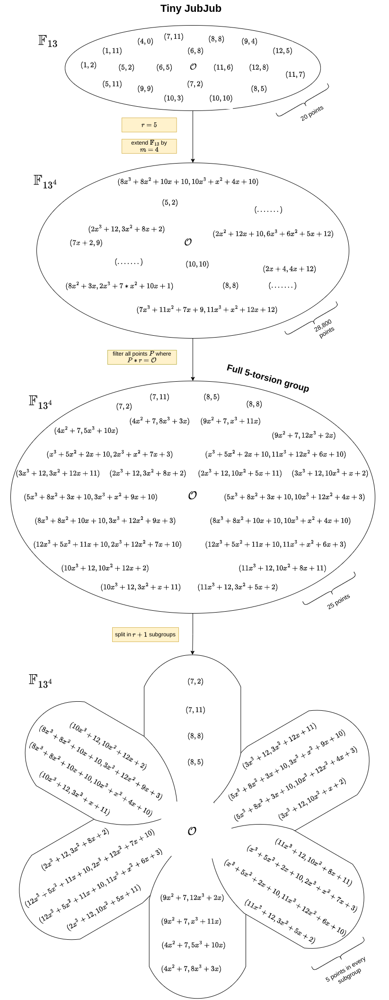
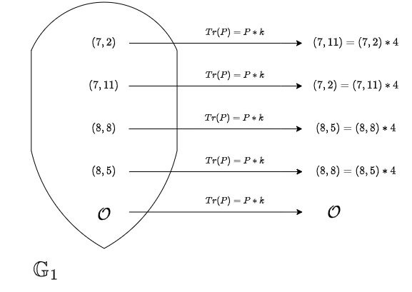
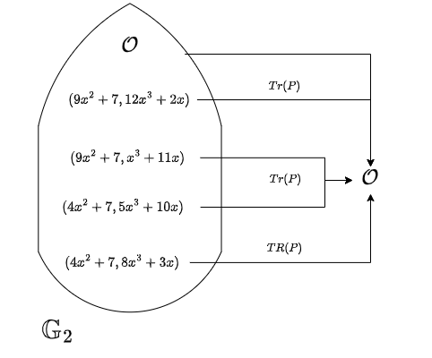

+++
date = '2024-06-17T10:52:24+02:00'
title = 'Pairings for the Rest of Us, part 1'
math = true
summary = 'Part 1 of a series on elliptic curve pairings. Learn about field extensions, the Frobenius endomorphism, and the Trace map to identify G1 and G2 subgroups.'
images = ['images/post-cover.png']
series = ['Pairings for the rest of us']
tags = ['Elliptic curves', 'Cryptography']
ShowShareButtons = true
ShowPostNavLinks = true
ShowToc = true
+++
## Finding G1 and G2

Elliptic curve (EC) pairings are widely used in zero-knowledge proofs (ZKP) and, more broadly, cryptography. Most ZK learning sources suggest treating their inner workings as a black box and focusing on their application within different proof systems. This approach is often sufficient for beginners and most ZK practitioners. In general, “black-boxing” is a good strategy to approach complex topics if one wants to progress in learning quickly. Pairings are frequently implemented in commonly used libraries, making a basic understanding of their applications generally adequate.

However, for those genuinely curious about the underlying mechanics, delving deeper can be challenging. Resources tend to be math-heavy, introducing numerous new concepts and notations.

I speak from personal experience. Coming from a smart contract development background with no math expertise, I attended a ZK bootcamp (RareSkills) and worked through the “Moon Math Manual.” Despite my efforts to understand pairings more deeply, I was consistently hindered by the lack of entry-level resources. The first book one finds in a simple search is “Pairings for Beginners” by Craig Castello. The title sounds promising, right? It's rich in examples and simplifies many complex topics. Yet, most will agree it’s anything but for beginners. This lack of accessible resources motivated me to explore the topic further and write this article, hoping to assist fellow developers facing similar challenges.

The resources I used to learn about EC pairings and from which this text was greatly inspired:

- *"MoonMath Manual"* by "Least Authority"
- *"Pairings for Beginners"* by Craig Castello
- *"Compute the Tate Pairing"* by Michael Scott
- *"An Introduction to Mathematical Cryptography"* by J. Hoffstein, J. Pipher and J. Silverman

This article documents my learning journey. As a newcomer, I may have made some mistakes and inaccuracies, so I welcome your feedback.

### Goal and Prerequites
The goal of this article is to implement the Tate pairing of two EC points, $P$ and $Q$, starting from the basic principles and performing most of the computations step-by-step. We focus on the Tate pairing over the Weil pairing because in practice, the Tate pairing is more efficient to compute. Additionally, most libraries I examined (such as py_ecc, substrate-bn, and arkworks) implement the Tate pairing or its variations.

Please note that this article does not cover the characteristics of pairings or their applications in ZKP. Instead, **it aims to assist those who already have a general understanding of pairings and have ideally used them before**. Therefore, I assume prior knowledge of modular arithmetic, finite fields, elliptic curves, and the addition and multiplication of EC points. For those needing a refresher, I recommend [this video](https://www.youtube.com/watch?v=9TFEBuANioo) by OpenZeppelin as a good primer on pairings.

### Tiny JubJub

To facilitate representation and manual calculations, we will use an elliptic curve with a limited number of points, known as the “Tiny JubJub” curve, which is also featured in the “MoonMath Manual.”

The equation for this curve is $y^2 = x^3 + 8x + 8 \mod 13$. The elliptic curve consists of all pairs $(x, y)$ in the prime field $\mathbb{F}_{13}$ that satisfy this equation. Out of the $169$ possible pairs $(13 \times 13)$, only $20$ combinations of $(x, y)$ meet the criteria, giving our curve an order (cardinality) of 20 $(n=20)$:

$\{\mathcal{O}, (1, 2), (1, 11), (4, 0), (5, 2), (5, 11), (6, 5), (6, 8), (7, 2), (7, 11),(8, 5), (8, 8), (9, 4),$ 

$(9, 9), (10, 3), (10, 10), (11, 6), (11, 7), (12, 5), (12, 8)\}$

By definition, $P$ and $Q$ must come from two distinct cyclic subgroups with the same prime order, known as $\mathbb{G}_1$ and $\mathbb{G}_2$. While we can experiment with the points above to form different subgroups, we ultimately find that there are no two subgroups with the same prime order in “Tiny JubJub” over $\mathbb{F}_{13}$.

To resolve this, we extend the prime field $q$ and operate within a much larger group of points, encompassing the initial $20$ points.

### Field Extensions

An EC over a field extension is a subject that took me a while to internalize and build a clear mental model for. When I first encountered ECs, they seemed comprehensive and not too hard. Yes, points addition and multiplication are different from usual arithmetic, but you quickly make sense of them. Moving forward, I realized that much of the magic occurs in the field extensions. That’s why having a solid understanding of field extensions is crucial.

We previously defined the field $\mathbb{F}_{13}$ with elements $\{0, 1, …, 12\}$ and modulus $q = 13$. Now, what will the elements and the modulus of the quadratic extension ($\mathbb{F}_{13^2}$) look like? Here, a small precision: $13^2$ doesn’t mean we raise the modulus to the power of two but rather indicates that the new field contains $169$ elements. To represent the elements from the quadratic extension, we add a new dimension to the elements from the initial $\mathbb{F}_{13}$:

$\{(0, 0), (0, 1), …, (1, 0), (1, 2), (1, 3), …, (12, 11), (12, 12)\}$

Now, every element from $\mathbb{F}_{13^2}$ is represented by two elements from $\mathbb{F}_{13}$. Addition is intuitive: $(1, 2) + (2, 5) = (3, 7)$ or $(7, 9) + (8, 5) = (15, 14) = (2, 1)$. What about multiplication? For that, we need a quadratic modulus. One might guess it will have the same form $(a, b)$, but how do we choose it?

First, let’s look at a trick to facilitate arithmetic. We consider each element as a degree-1 polynomial; for example, $(4, 7)$ will be $4 + 7x$, or $(0, 5)$ will be $0 + 5x$. The modulus in the initial $\mathbb{F}_{13}$ is $13$, a prime number, meaning we can’t factor it (except as $1*13$). Remember, we can also refer to it as the zero of the finite field because $13 = 0$. 

The equivalent of prime numbers in the realm of polynomials is **the irreducible polynomials**. For example, the polynomial $x^2 - 1$ can be factored as $(x - 1)(x + 1)$, so it is reducible. Intuitively, we must select a polynomial that’s irreducible in $\mathbb{F}_{13}$ and will serve as the modulus in our quadratic extension. While the elements in the quadratic extension are represented by a degree-1 polynomial, the modulus needs to be a degree higher. The polynomial $x^2 + 2$ satisfies these requirements, so it will act as the zero in the extension, $x^2 + 2 = 0$ or $x^2 = -2$.

Back to the question about multiplication in the quadratic extension:

$(7, 3) * (5, 6) = (7 + 3x) * (5 + 6x) = 35 + 15x + 42x + 18x^2 = 35 + 57x + 18x^2$

Reducing the coefficients $\mod 13$, we end up with $9 + 5x + 5x^2$, but remember, in the quadratic extension $x^2 = -2$, so

$9 + 5x + 5x^2 = 9 + 5x - 10 = -1 + 5x = 12 + 5x$ (with $-1 = 12 \mod 13$).

Thus,

$(7, 3) * (5, 6) = (12, 5)$

The same process can be applied to higher-degree extensions.

Some key takeaways:
1. Extending a field means adding a new dimension to every element.
2. Each higher extension includes the elements from the previous one and adds many more.
3. The polynomial, which is the modulus of the extended field, must be one degree higher than the elements in the field and irreducible in the base finite field.

We can return to the “Tiny JubJub” curve and better depict its points over $\mathbb{F}_{13^2}$. For example, the point $(5, 2)$ becomes $((5 + 0x), (2 + 0x)) = ((5, 0), (2, 0))$. Moreover, we’ll also find brand new points such as $((12 + 3x), (9 + x)) = ((12, 3), (9, 1))$. Next to the initial $20$ points, we can count an additional $140$ points. That makes the order of the curve over $\mathbb{F}_{13^2}$ equal to $160$.

### Full $r$-torsion Group

Now that we have a basic understanding of ECs over extension fields, we can delve into finding **distinct subgroups with points of the same prime order**. To achieve this, we extend the base field by a specific value, $m$. How do we determine $m$? 

Here are the steps to follow:

1. Find a prime factor of the curve order, typically the largest one. Recall the order of the “Tiny JubJub” curve $n = 20$ and $20 = 2 \times 2 \times 5$. Assign this factor to $r = 5$.

2. Find the smallest $k$ such that $r$ divides $q^k - 1$ without remainder. 
    - $k = 1$ doesn’t work because $13^1 - 1 = 12$, and $5$ doesn’t divide $12$
    - $k = 2$ and $k = 3$ yields the same result
    - for $k = 4$, we find $13^4 - 1 = 28560$, which is divisible by $5$

    Hence, we assign $k = 4$ as **the embedding degree**.

3. Extend the base field $\mathbb{F}_{13}$ by $m$, where $m = k$. This defines “Tiny JubJub” over $\mathbb{F}_{13^4}$, resulting in $28,800$ points.

4. Out of these $28,800$ points, identify those whose order under multiplication by $r$ results in the point at infinity. These points constitute the **full 5-torsion group**, totaling $25$ points.

5. Divide the full 5-torsion group into $6$ subgroups ($r + 1$). Note that the point at infinity is common across all subgroups. As you might have guessed, we're close to finding the grail: $\mathbb{G}_1$ and $\mathbb{G}_2$ are among those subgroups. It’s worth noting here that one of these subgroups (top center) contains the same points as some from the non-extended curve.

Note: The section on the “Full $r$-torsion group” raises the question of whether non-full $r$-torsion groups exist, and the answer is yes: by extending the field by $m$ where $m < k$. However, this does not always guarantee that we will find the subgroups we're looking for.

### Frobenius Endomorphism and Trace Map

Having established the embedding degree $k = 4$ and extended the base field by $m = k$, we explored the resulting group with many new points (28,800), focusing on those that mapped to the infinity point $\mathcal{O}$ when multiplied by $r = 5$. This group of 25 points is known as the full 5-torsion group. Further, we divided the full 5-torsion group into 6 distinct subgroups. The goal now is to identify $\mathbb{G}_1$ and $\mathbb{G}_2$. To achieve this, we must first understand the Frobenius endomorphism and the Trace map $Tr(P)$.

#### Frobenius Endomorphism

The Frobenius endomorphism is a map $\pi$ that simply raises each coordinate of an EC point to the power of the base field:

$$
\pi(x, y) → (x^q , y^q)
$$

This operation guarantees that the resulting point **remains within the group** (hence the term "endomorphism"). For instance, taking a point from the EC over the non-extended field and raising it to the power of $q$, we obtain the same point:

$(7, 11) \rightarrow 7^{13} = 7 \pmod{13} \text{ and } 11^{13} = 11 \pmod{13}$

In larger extensions, such as over $\mathbb{F}_{13^4}$, we first raise $q = 13$ to $m = 4 \Rightarrow 13^4 = 28561$, and then:

$(7, 11) \rightarrow 7^{28561} = 7 \pmod{13} \text{ and } 11^{28561} = 11 \pmod{13}$

You might not find the Frobenius endomorphism interesting at first glance, but bear with me.

#### Trace Map

The Trace map $Tr(P)$ raises the coordinates of a point, similarly to the Frobenius endomorphism. However, it does this iteratively, based on the embedding degree and results in the sum of the intermediary points:

$$
Tr(P) = \sum\limits_{i=0}^{k-1}(x^{q^i}, y^{q^i})
$$

Remember, we found the embedding degree $k = 4$, so $Tr(P)$ in our case will look like this:

$Tr(P) = (x^{q^0}, y^{q^0}) + (x^{q^1}, y^{q^1}) + (x^{q^2}, y^{q^2}) + (x^{q^3}, y^{q^3})$

If we apply the Trace map, something interesting will happen for some of the points from the full 5-torsion group.

### Subgroup G1

As you might have already guessed, the $\mathbb{G}_1$ points are the ones that suspiciously resemble the non-extended curve. Applying the Trace map to them will result in another point from the same subgroup; $Tr$ has the **effect of multiplication by $k$**. 

Let’s demonstrate with $R = (7, 11)$:

- $R_0 = R = (7, 11)$
- $R_1 = (7^{13}, 11^{13}) = (7, 11)$
- $R_2 = (7^{13^2}, 11^{13^2}) = (7, 11)$
- $R_3 = (7^{13^3}, 11^{13^3}) = (7, 11)$

$R_0 + R_1 + R_2 + R_3 = (7, 2) = (7, 11) \ast k = (7, 11) \ast 4$

### Subgroup G2

   Let's take $S = (4x^2 + 7, 5x^3 + 10x)$ from the lower center subgroup:

1. Calculate $k$ intermediary points by successively raising the point's coordinates

   
     - $S_0 = S = (4x^2 + 7, 5x^3 + 10x)$
     - $S_1 = ((4x^2 + 7)^{13}, (5x^3 + 10x)^{13}) = (9x^2 + 7, x^3 + 11x)$
     - $S_2 = ((4x^2 + 7)^{13^2}, (5x^3 + 10x)^{13^2}) = (4x^2 + 7, 8x^3 + 3x)$
     - $S_3 = ((4x^2 + 7)^{13^3}, (5x^3 + 10x)^{13^3}) = (9x^2 + 7, 12x^3 + 2x)$

2. Summing up these intermediary points using the group addition law $S_0 + S_1 + S_2 + S_3$ results in  $\mathcal{O}$, the infinity point. Applying the Trace map to the other $4$ points from the subgroup yields the same result. Congratulations, we just found the points from $\mathbb{G}_2$.

### Conclusion

In this article, we covered the foundational concepts for understanding elliptic curve pairings over field extensions, focusing on the Frobenius endomorphism and the Trace map to identify subgroups $\mathbb{G}_1$ and $\mathbb{G}_2$ .

In [the next part](/post/pairings-for-the-rest-of-us-2), we will implement the Tate pairing step-by-step, applying the knowledge we've gained. Stay tuned!

---
I welcome any feedback, corrections, or suggestions to improve the content and help all readers better understand the subject. Thank you for joining me on this journey and feel free to connect with me on X at [@BoyanBarakov](https://x.com/BoyanBarakov).
